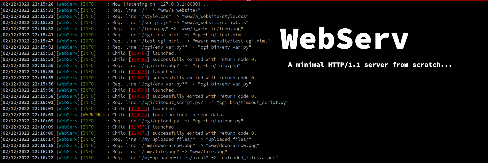

# 42-webserv

We're all using the web everyday, and for most of us since our childhood. Maybe it's time to buckle up, and make a minimal but fully working HTTP/1.1, that can handle basic requests (**GET**, **POST**, **DELETE**).

 

 
 

# Features
- [x] File uploading using **POST** w/ *multipart/form-data*.
- [x] A fully configurable behavior inspired by nginx.
- [x] Setup multiple CGI scripts (under **CGI/1.1**)
- [x] Directory listing.
- [x] Streaming parsing : the server doesn't wait the whole request to start processing it.
- [x] Basic security features.
- [ ] Conditionnaly compliant with RFC 9110 and RFC 9112.
*note: this can take a LONG time, and is not worth it considering this server is a school project. the parsing enforces many advice and MUST requierement tho.*